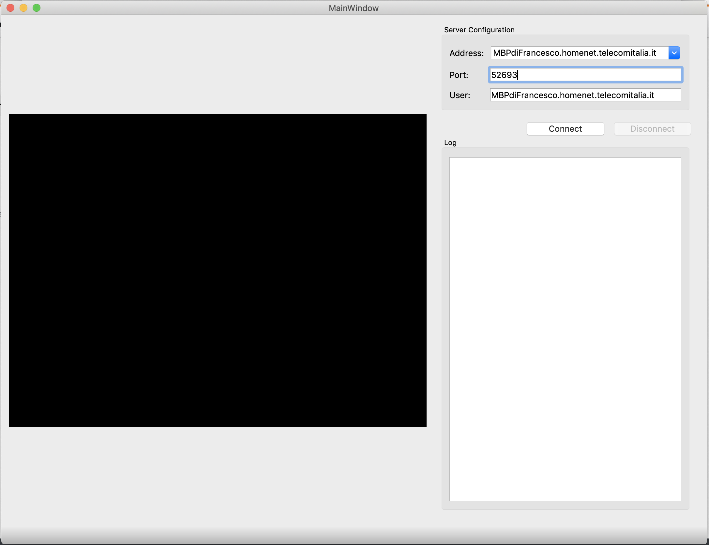
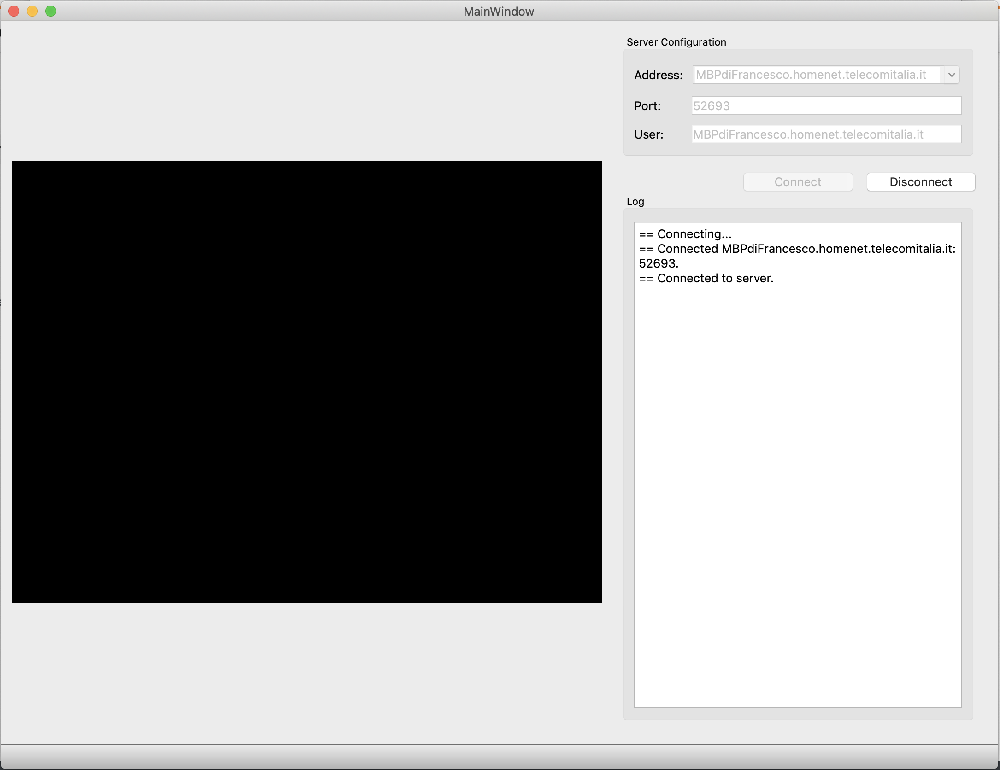
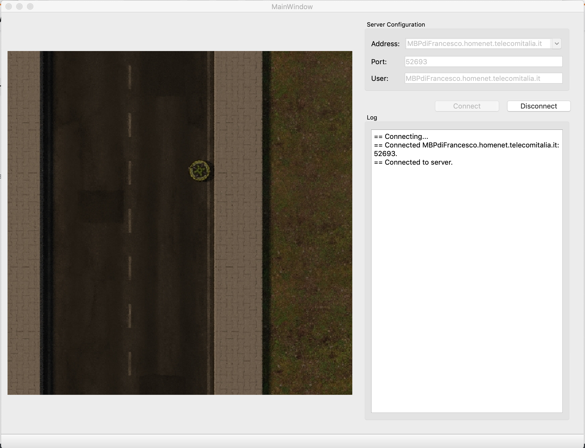
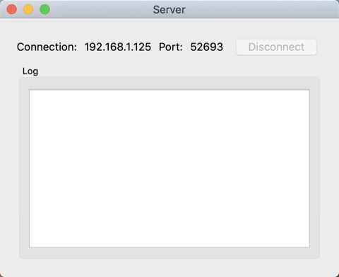
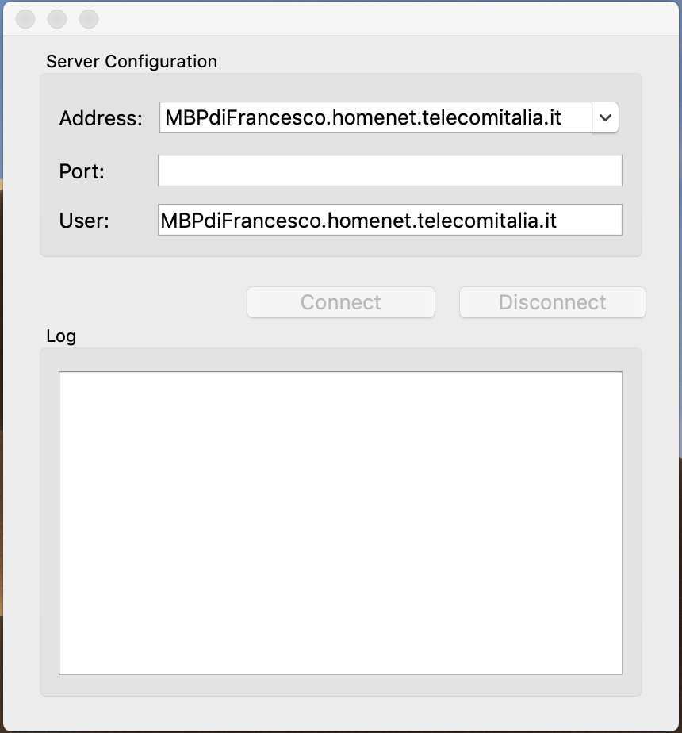
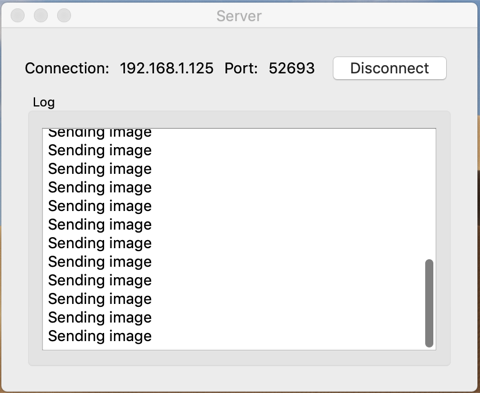
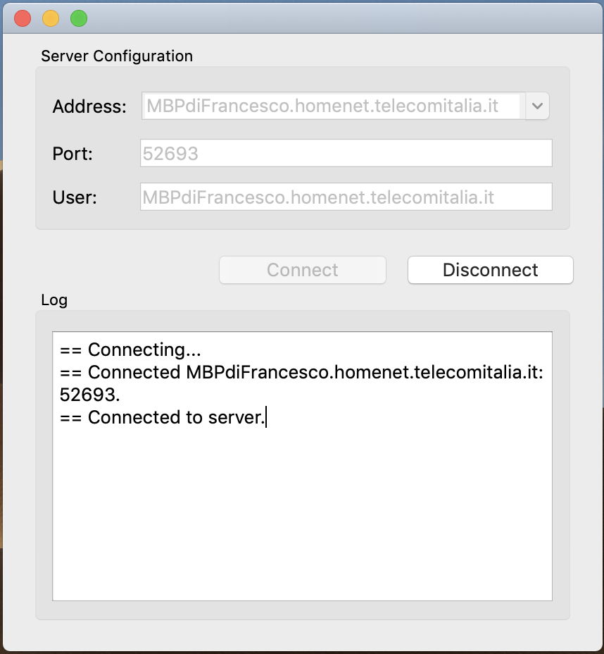

# QtSocket

| Branch  |      	  |           |
|:-------:|:---------:|:---------:|
| Master  | [](https://travis-ci.org/frank1789/QtSocket.svg?branch=master) | [](https://coveralls.io/github/frank1789/QtSocket) |
| Develop | [](https://travis-ci.org/frank1789/QtSocket.svg?branch=develop) | [](https://coveralls.io/github/frank1789/QtSocket) |

This program connects to a TCP socket allowing the reception of a streaming
image from the main program available in the repository
[Flir-Lepton](https://github.com/frank1789/Flir-Lepton/tree/develop) thus allows
the communication between the Raspberry Pi 3b and the Google Coral Dev Board.

## Prerequisites

### Linux - MacOS - Raspbian

* Qt 5.9 or above
* CMake 3.7 or above (check the raspberry version may differ from the desktop
	version)
* gcc or clang compatible C++17
* _Note: Linux require compile tensorflow lite and add support in CmakeLists_

### Google Coral Dev-Board

* Qt 5.9 or above
* CMake 3.7 or above (check the raspberry version may differ from the desktop
	version)
* gcc or clang compatible C++14

## Start
### Execute Program - Receiver

To compile and run the program run the following commands
 
```bash
git clone https://github.com/frank1789/QtSocket.git
cd Receiver
./build.sh
```

The images below show how the program interface will appear.
To start receiving images you must enter:
* the server address (shown by the software [Flir-Lepton](https://github.com/frank1789/Flir-Lepton/tree/develop))
* the port to connect to by **default** is: **52693**





### Perform Test - Receiver
Alternatively to run the tests:

```bash
git clone https://github.com/frank1789/QtSocket.git
cd Receiver
./build.sh debug
```

## OLD
### Other part
To run project build Sender

```sh
mkdir build
cd build
cmake -D CMAKE_BUILD_TYPE=Debug ..
make
EXECUTABLE=$(find $PWD -name "QtSocket")
${EXECUTABLE}
```

Once the program has started, will be appear like this:




enter the value 52693 in the port and the image or text stream will start.



