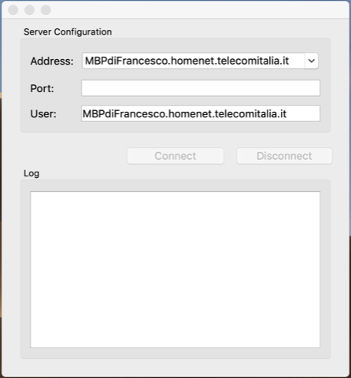
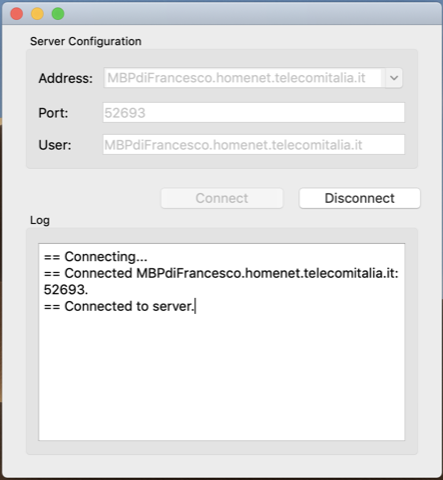
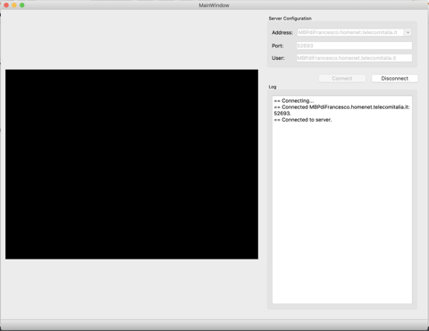

# QtSocket

This project creates a TCP socket in Qt to allow communication between 2 or more devices.
it is used as a module for the main project [Flir-Lepton](https://github.com/frank1789/Flir-Lepton/tree/develop) thus allows the communication between the Raspberry Pi 3b and the Google Coral Dev Board.

## Prerequisites

* Qt 5.5 or above
* CMake 3.7 or above (check the raspberry version may differ from the desktop version)
* gcc or clang compatible C++14 or above


# Before starting

Edit the _src/tcpclient.cpp_ file on line 419 to update the path to the folder containing the images

```cpp
QImage randomImage() {
  qsrand(QTime(0, 0, 0).secsTo(QTime::currentTime()));

  QDir dir("/path/your/folder/image");
  dir.setFilter(QDir::Files);
  QFileInfoList entries = dir.entryInfoList();

  if (entries.size() == 0) {
    qDebug("No images to show!");
    return QImage();
  }
  qDebug() << entries.at(qrand() % entries.size()).absoluteFilePath();
  return QImage(entries.at(qrand() % entries.size()).absoluteFilePath());
}
```

Alternatively it is possible to disable the sending of images and use only a text message by removing the TEST_IMAGE parameter from the _src/CMakeLists.txt_ file on line 15:

* Enable image message
```cmake
add_definitions(-DLOGGER -DLOGGER_SERVER -DTEST_IMAGE)
```

* Enable text message

```cmake
add_definitions(-DLOGGER -DLOGGER_SERVER)
```

## Start

To run project build Sender

```sh
mkdir build
cd build
cmake -D CMAKE_BUILD_TYPE=Debug ..
make
EXECUTABLE=$(find $PWD -name "QtSocket")
${EXECUTABLE}
```

Build Receiver

```sh
mkdir build
cd build
cmake -D CMAKE_BUILD_TYPE=Debug ..
make
EXECUTABLE=$(find $PWD -name "QtReceiver")
${EXECUTABLE}
```

Once the program has started, will be appear like this:




enter the value 52693 in the port and the image or text stream will start.




You need to use a second client to receive messages by repeating the previous
steps.





